## 📚 통합 교육 플랫폼(LMS) 개발 프로젝트

> 질문을 등록하고 답변을 확인하는 질의응답 서비스와  
> AI 답변 생성 및 챗봇 기능을 함께 제공하는 LMS 프론트엔드 프로젝트입니다.

---

## 📖 프로젝트 소개

> 학습은 강의를 듣는 것에서 끝나지 않습니다.
> 학습 중 생긴 궁금증을 바로 질문하고, 답변을 확인하고, 필요한 경우 대화로 이어질 수 있어야
> 더 끊기지 않는 학습 경험이 만들어집니다.
> 이 프로젝트는 강의 탐색과 학습, 질의응답, 채팅 기능을 하나로 연결한
> `통합 교육 플랫폼(LMS)`입니다.

## 🔗 배포 링크

> ### [배포 바로가기](https://oz-externship-fe-07-team2.vercel.app)

---

## 🚀 Getting Started

```yaml
- packageManager: pnpm
- react: 19
- storybook: 10.2
```

### 환경 변수 설정

프로젝트 루트 디렉토리에 `.env` 파일을 생성하고 아래 값을 추가합니다.

```env
VITE_API_BASE_URL=your_api_base_url_here
```

### 개발 서버 실행

```bash
pnpm install
pnpm dev
```

### Storybook 실행

```bash
pnpm storybook
```

---

## 🗣️ 발표 영상 & 발표 문서

📅 2026.03.02 - 2026.03.31

> ### [📺 발표 영상]()
>
> ### [📑 발표 문서](https://doc-0g-7c-apps-viewer.googleusercontent.com/viewer/secure/pdf/u1ligkkqqo2upst491m9ah3t70afj2gb/su5667k73g7s85s1i69d78vg9kmbi6tp/1774985775000/drive/14246550380768199504/ACFrOgBrSIE1fKzFgfnIJ1U1OtuJjP5WDcB_TWxy8SnokQCVAsaiHc1Uv7HiW2Nw2os797mmOY0eS_6nbiS9Q9CnGPKnvteCP2VEjdIauOL-FSK15-wQ4LkxZxfzJQ45Q5nyTG8LYMdlif9zNS1-bRT_YKxCLj4ORelFDQ5XLJg6DAxEzDfqZPRyebgcU6GrxNB2ttC4Uwdc99wP6PE46xyGE0f_-qtPZxEBZDx4RnfTd71f055hWf2YqCqZWC3_gY8qngJFgebveAZPTt9sdaqPu1A1bAPzh0Rwm2Nccg==?print=true&nonce=c21j28egjj9p2&user=14246550380768199504&hash=u3ndp8601mpmrkdv6psqnhs9utkvc3m7)

---

## ✨ 주요 기능

### 질의응답 목록 페이지

- 검색 기능
- 최신순 / 조회수순 정렬
- 카테고리 조회 및 필터
- 목록 페이지네이션

```md
1. 질의응답 목록 페이지
   - 목록 조회 기능: 최신순/조회수순 정렬, 검색어 입력, 카테고리 조회 및 필터, 페이지네이션을 지원합니다.
```

|                                        목록 조회                                         |                                           검색 및 필터                                           |
| :--------------------------------------------------------------------------------------: | :----------------------------------------------------------------------------------------------: |
| 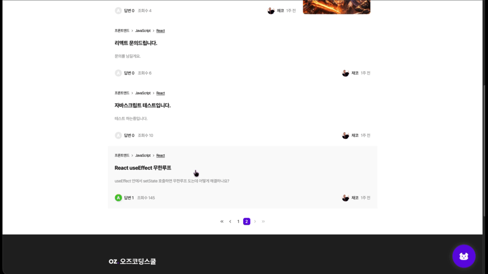 | 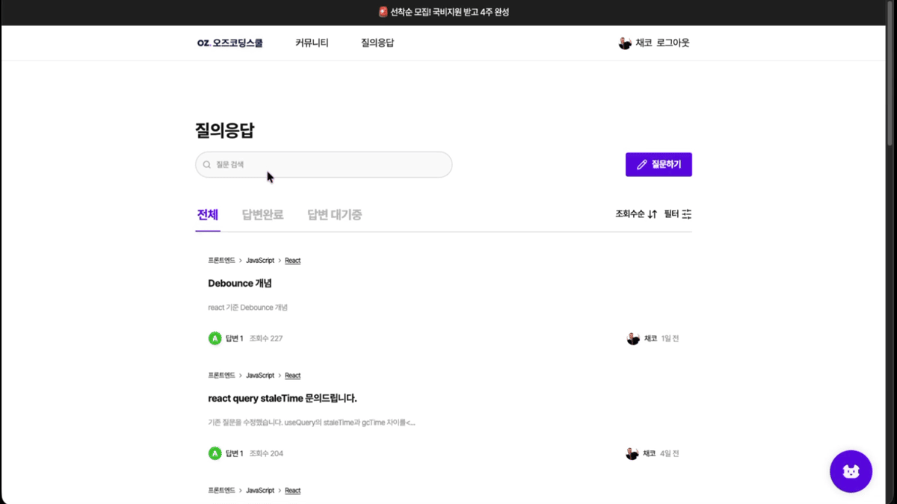 |

### 질문 등록 및 수정

- 질문 등록
- 질문 수정
- 마크다운 에디터 지원
- 이미지 업로드
- 입력값 유효성 검사

```md
2. 질문 등록 및 수정
   - 질문 작성 기능: 로그인한 수강생은 제목, 본문, 카테고리, 이미지 등을 포함해 질문을 등록할 수 있으며, 마크다운 에디터를 통해 내용을 작성할 수 있습니다.
   - 질문 수정 기능: 질문을 등록한 작성자만 기존 질문 데이터를 불러와 수정할 수 있습니다.
```

|                                     질문 등록                                     |                                    질문 수정                                    |
| :-------------------------------------------------------------------------------: | :-----------------------------------------------------------------------------: |
| 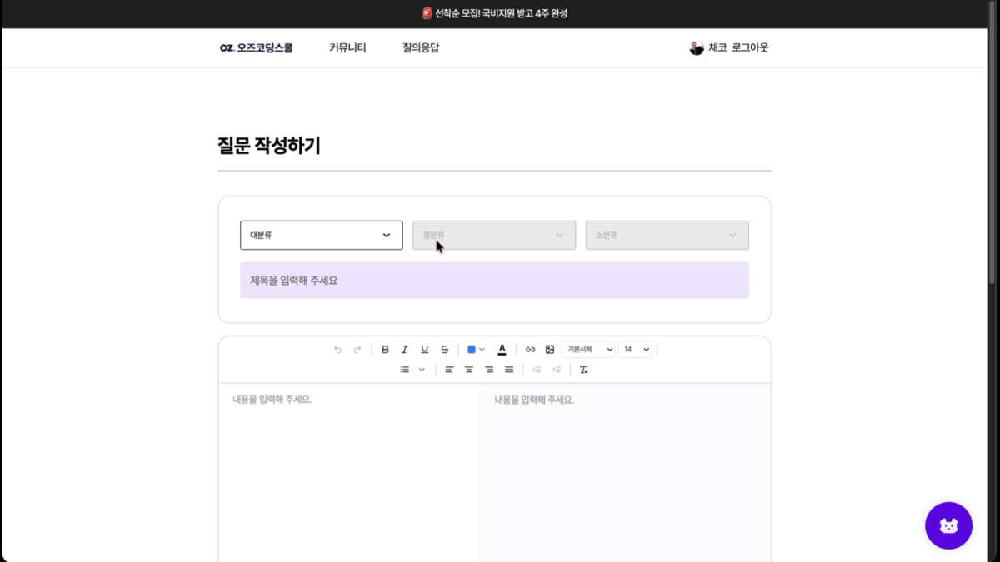 | 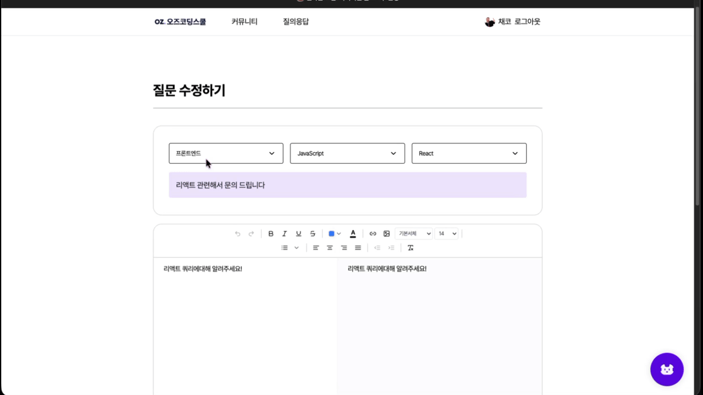 |

### 질의응답 상세 페이지

- 상세 조회 기능
- AI 답변 생성
- 답변 작성 및 수정
- 질문 채택 기능

```md
3. 질의응답 상세 페이지
   - 상세 조회 기능: 질문 본문, 답변 목록, 댓글, 작성자 정보 등 상세 데이터를 확인할 수 있습니다.
   - AI 답변 생성: 질문 등록 시 최초 1회만 AI 답변을 생성할 수 있습니다.
   - 답변 작성 및 수정: 답변을 작성하고 수정할 수 있습니다.
   - 질문 채택 기능: 질문을 등록한 사용자만 답변을 채택할 수 있습니다.
```

|                                     질의응답 상세                                     |                                   AI 답변 생성                                   |                                     답변 작성 및 수정                                     |
| :-----------------------------------------------------------------------------------: | :------------------------------------------------------------------------------: | :---------------------------------------------------------------------------------------: |
| 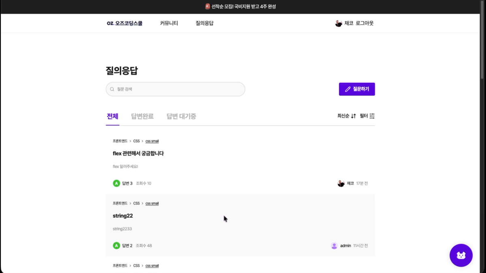 | 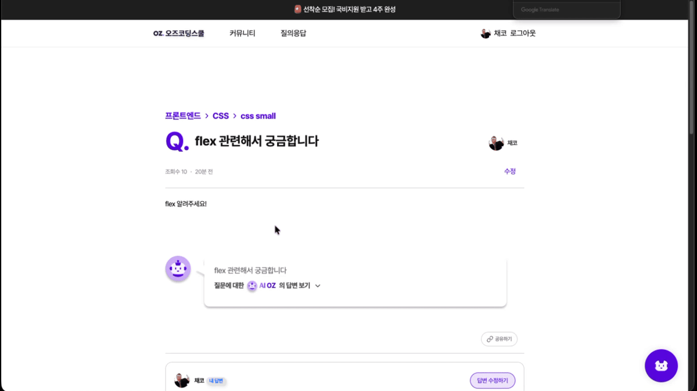 | 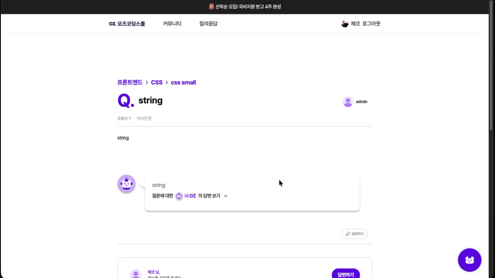 |

### AI 채팅 및 챗봇

- QnA AI 챗봇
- AI 시스템 챗봇

```md
4. AI 채팅 및 챗봇
   - QnA AI 챗봇: 질문 상세 페이지의 추가 질문 버튼을 통해 질문 문맥을 이어서 AI 채팅을 시작할 수 있습니다.
   - AI 시스템 챗봇: 플로팅 버튼을 클릭하면 별도 질문 문맥 없이 1회성 시스템 챗봇을 이용할 수 있습니다.
```

|                                      QnA AI 챗봇                                      |                                     AI 시스템 챗봇                                      |
| :-----------------------------------------------------------------------------------: | :-------------------------------------------------------------------------------------: |
|  | 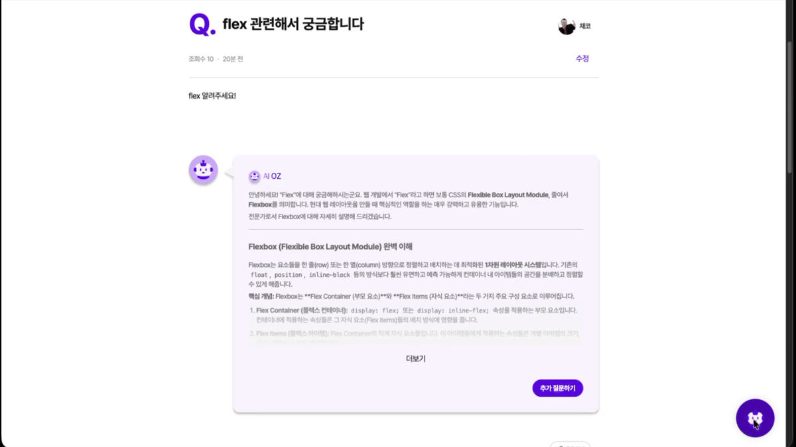 |

### 사용자 상태 기반 접근 제어

- 비회원 접근 제한
- 일반유저 권한 분기
- 수강생 전용 기능 이용

```md
5. 사용자 상태 기반 접근 제어
   - 비회원: 상세 조회 등 공개 화면만 접근할 수 있으며, 질문 작성·답변 작성·추가 질문 등 회원 기능은 제한됩니다.
   - 일반유저: 로그인은 가능하지만 수강생 전용 기능은 제한되며, 권한 안내 UI가 노출됩니다.
   - 수강생: 질문 작성, 답변 작성, 추가 질문 등 수강생 전용 기능을 이용할 수 있습니다.
```

|                                     비회원 접근 화면                                      |                                     일반유저 화면                                      |                                      수강생 화면                                      |
| :---------------------------------------------------------------------------------------: | :------------------------------------------------------------------------------------: | :-----------------------------------------------------------------------------------: |
| 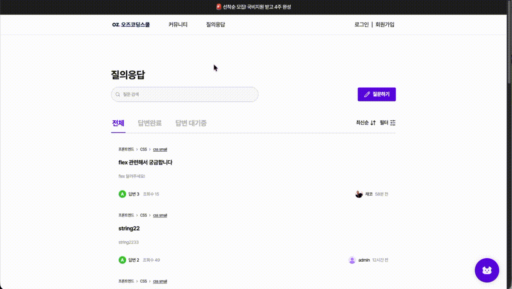 | 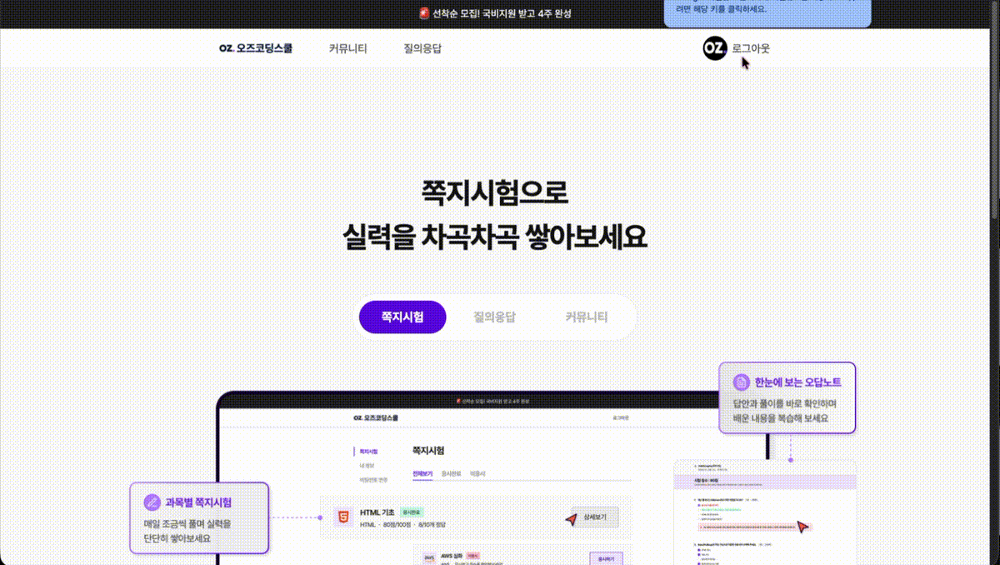 | 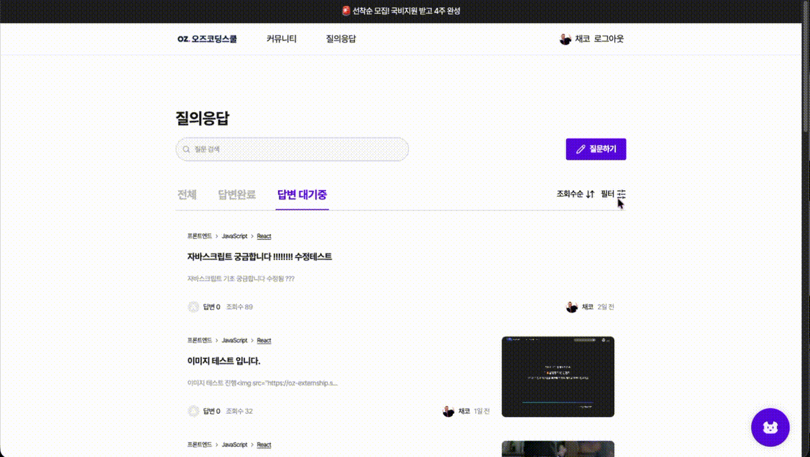 |

---

## 🧰 사용 스택

### Frontend Architecture

<p align="center">
  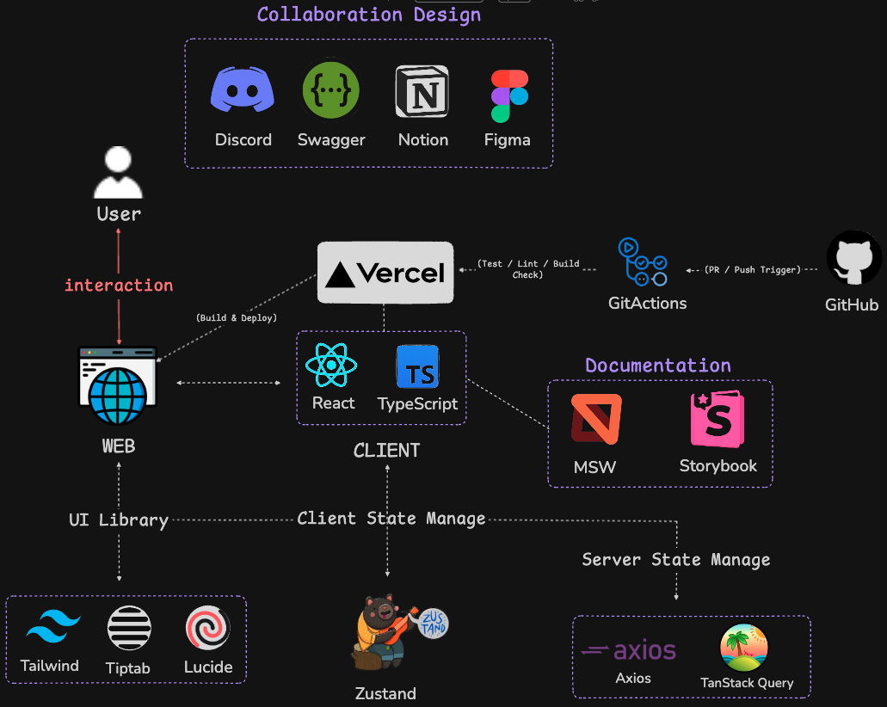
</p>

#### Framework / Language

<div>
  
  
  
  
</div>

#### Styling / UI

<div>
  
  
  
  
</div>

#### State Management

<div>
  
  
  
  
</div>

#### Code Quality / Dev Tools

<div>
  
  
  
  
  
</div>

#### Deploy

<div>
  
</div>

---

## :busts_in_silhouette: 팀 동료

### FE

| <a href="https://github.com/alstmd9902"><br/><sub><b>@alstmd9902</b></sub></a> | <a href="https://github.com/fishwwww2"><br/><sub><b>@fishwwww2</b></sub></a> | <a href="https://github.com/SammyLee519"><br/><sub><b>@SammyLee519</b></sub></a> |
| :-------------------------------------------------------------------------------------------------------------------------------------------------: | :----------------------------------------------------------------------------------------------------------------------------------------------: | :----------------------------------------------------------------------------------------------------------------------------------------------------: |
|                                                                       오승연                                                                        |                                                                      김채현                                                                      |                                                                         이샘물                                                                         |
|                                                                     팀장 (Lead)                                                                     |                                                                       팀원                                                                       |                                                                          팀원                                                                          |
|                                  챗봇, AI 답변 생성, 카테고리 필터, 질문 목록 페이지 구현,<br/>공통 컴포넌트 구현                                   |                                             질문 상세 페이지, 답변 등록/수정,<br/>공통 컴포넌트 구현                                             |                                      질문 등록/수정 페이지, Toast UI,<br/>에러/성공 상태 처리, 공통 컴포넌트 구현                                      |

## 📑 프로젝트 규칙

> 자세한 내용은 각 문서를 참고해주세요.

| 문서                                            | 설명            |
| ----------------------------------------------- | --------------- |
| [BRANCH.md](./docs/BRANCH.md)                   | 브랜치 전략     |
| [COMMIT.md](./docs/COMMIT.md)                   | 커밋 컨벤션     |
| [CONVENTION.md](./docs/CONVENTION.md)           | 코드 컨벤션     |
| [STRUCTURE.md](./docs/STRUCTURE.md)             | 프로젝트 구조   |
| [TROUBLESHOOTING.md](./docs/TROUBLESHOOTING.md) | 트러블슈팅 기록 |
| [README.md](./docs/README.md)                   | 문서 가이드     |

## :clipboard: Documents

> [📜 API 명세서](https://docs.google.com/spreadsheets/d/1x6AFgjoFvBZPOV8gF-BhMxeUJuaNVXu9HwMqg-Pzrs8/edit?gid=0#gid=0)
>
> [📜 요구사항 정의서](https://docs.google.com/spreadsheets/d/1CGE8X8weUpm9_qwQ6y2K7XwTwmZT8ON9R7tRCC7NzDc/edit?gid=0#gid=0)
>
> [📜 화면 정의서](https://www.figma.com/design/k2hDdksMNGoRNXvjmH5Etc/%ED%99%94%EB%A9%B4%EC%A0%95%EC%9D%98%EC%84%9C-%EC%A7%88%EC%9D%98%EC%9D%91%EB%8B%B5-?node-id=0-1&p=f)
>
> [📜 플로우 차트](https://www.figma.com/board/utn8chciTh9LzUQ543M1eg/Untitled?node-id=0-1&p=f)
